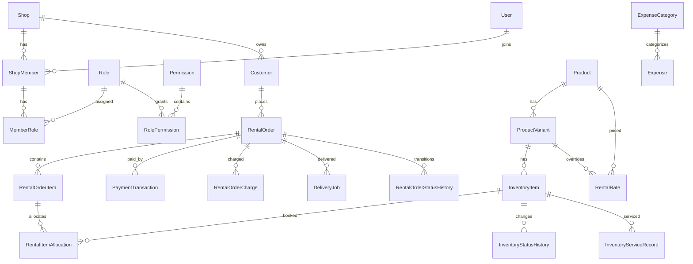

# Database design

Manual confirmation storage and transaction invariants: [Admin confirmation](ADMIN_CONFIRMATION.md).

PostgreSQL is the source of truth. Prisma is the application ORM, while committed SQL migrations may contain PostgreSQL-specific constraints Prisma cannot express (notably booking exclusion constraints).

## High-level ERD



## Product versus physical inventory

`products` describes a sell/rent-facing model such as “Váy Aurora”. `product_variants` describes size/color variants. `inventory_items` describes individual physical pieces such as `AUR-S-RED-001`.

Never replace this with a simple `products.quantity`. Individual pieces have different booking, cleaning, repair, damage and loss states.

## Rental interval semantics

Intervals are half-open: `[reserved_from, reserved_until)`.

A booking ending exactly at 12:00 and another beginning at exactly 12:00 do not overlap. If the shop needs cleaning/buffer time, extend `reserved_until` when allocating or introduce an explicit blocking allocation policy; do not weaken the database constraint.

The production protection lives in the initial migration:

```sql
EXCLUDE USING gist (
  inventory_item_id WITH =,
  tstzrange(reserved_from, reserved_until, '[)') WITH &&
)
WHERE (status IN ('HELD', 'CONFIRMED', 'ACTIVE'));
```

## Inventory operational condition vs Rental occupancy

Physical inventory operational condition and rental reservation occupancy are strictly decoupled:

- `inventory_items.current_status`: Only stores physical operational states (`AVAILABLE`, `CLEANING`, `REPAIRING`, `DAMAGED`, `LOST`, `RETIRED`). Enforced by PostgreSQL constraint `inventory_items_operational_status_check`.
- `rental_item_allocations`: Sole source of truth for rental reservations and occupancy (`HELD`, `CONFIRMED`, `ACTIVE`, `RETURNED`, `CANCELLED`).
- Rental lifecycle transitions do not set `inventory_items.current_status = 'RENTED'`.
- Items with active unreleased allocations (`status = 'ACTIVE'`, `released_at IS NULL`) remain occupied regardless of elapsed `reserved_until` timestamps.

## Rental status dimensions

Order lifecycle and money state are separate:

- order status: `RESERVED`, `CONFIRMED`, `ACTIVE`, `COMPLETED`, `CANCELLED`.
- payment status: `UNPAID`, `PARTIALLY_PAID`, `PAID`, `REFUNDED`.
- deposit status: `NOT_REQUIRED`, `PENDING`, `PARTIALLY_HELD`, `HELD`, `PARTIALLY_REFUNDED`, `REFUNDED`, `FORFEITED`.

`OVERDUE` is derived from `rentalEndAt < now` plus an active order status. Do not persist it as an independent source of truth.

## Money

All money uses `NUMERIC(18,2)`. Do not change to floating-point.

A payment transaction records direction (`IN`/`OUT`) and purpose. Deposits (`DEPOSIT`, `DEPOSIT_REFUND`) are excluded from realized revenue reporting.

Order monetary columns are immutable-ish snapshots used for operational speed and historical correctness. Payment status is recomputed from transaction history after a money movement.

## Snapshots

`rental_order_items` stores product/variant names and agreed prices at booking time. Catalog price/name changes must not rewrite historical orders.

## Deletion policy

- catalog/customer: archive where historical records exist.
- orders: status transition, never hard-delete after business use.
- payment/expense: void, never silently delete.
- audit history: append-only.

## Multi-tenancy

Each tenant-owned aggregate stores `shop_id`; application repositories scope queries using authenticated `shopId`. Cross-shop IDs from request bodies must be validated in the same shop. Before exposing this as a public multi-tenant SaaS, add PostgreSQL RLS or composite tenant foreign keys as a second isolation layer.

Audit request IDs use VARCHAR(100), matching middleware correlation IDs, through
202609110001_audit_request_id_text. Rental idempotency reuses row UUID as an ownership
token and createdAt as acquisition time; see [RELIABILITY.md](RELIABILITY.md) before deployment.

Customer phone identity is canonicalized to a ten-digit Vietnamese national number
(`0xxxxxxxxx`) and unique per shop. It is a CRM lookup key only: matching a phone never
authorizes linking a User account; a future account link must require verified phone ownership.
Migration `202609120001_customer_phone_uniqueness` backfills from the display phone and reports
invalid or duplicate legacy rows for manual reconciliation without merging customer history.

## Migration rules

1. Edit `prisma/schema.prisma`.
2. For ordinary schema changes run `npm run db:migrate:dev -- --name <name>`.
3. Inspect generated SQL before committing.
4. Add PostgreSQL-specific indexes/constraints manually when needed.
5. Never use `prisma db push` in production.
6. Deploy with `prisma migrate deploy`.
7. Use expand/migrate/contract for destructive/high-volume changes.

### Operational-status repair migration

`202609110003_repair_inventory_operational_status` normalizes legacy RESERVED/RENTED
values to AVAILABLE only when an unreleased blocking allocation exists in the same
shop. Orphaned values become CLEANING for inspection before reuse. Allocation rows,
status history and financial history are preserved; the migration is transactional
and adds `inventory_items_operational_status_check`. The original
`rental_item_no_overlap` exclusion constraint is unchanged. Unexpected operational
values fail the CHECK rather than silently being rewritten.

Deploy with rental/warehouse writers stopped, apply the migration, then start the
new application version. Old instances that persist RENTED are incompatible with
the new CHECK. Do not run old and new writers concurrently during deployment.

### Catalog archive and pricing integrity

Product and inventory archive use the shared unreleased HELD/CONFIRMED/ACTIVE
allocation predicate, without a date cutoff. Product archive and booking both use
Serializable transactions: booking reads the product/variant rentability through
the selected inventory inside its transaction, and archive reads allocations
before changing the product. PostgreSQL aborts concurrent stale decisions for retry.
Raw external SQL writers must follow this protocol; archive is not a SQL trigger.

`202609110004_harden_rental_rate_and_media_uniqueness` adds:

- `rental_rates_variant_active_unique`: active (shop, product, variant, duration).
- `rental_rates_product_active_unique`: active (shop, product, duration), NULL variant only.
- `product_variants_unarchived_combination_unique`: unarchived (product, size, color),
  with PostgreSQL NULLS NOT DISTINCT so absent size/color cannot bypass uniqueness.
- `product_media_product_id_primary_unique`: one primary media row per product.

Pricing lookup prefers the variant rate, then the product-level fallback, for the
requested duration. Existing validFrom/validUntil fields are not part of pricing
selection, so they do not create separate active scopes. Inactive rates remain
unrestricted; the existing price command updates the active row in place.

The migration locks the affected tables and checks duplicates before creating
indexes, all in one transaction. It deliberately fails for duplicate active rates,
unarchived variant combinations or primary media, without choosing a price,
merging physical identities, or deleting history. Reconcile reported duplicate
scopes before retrying deployment. This requires PostgreSQL 15+ (the repo uses 17).
Plan a write maintenance window for index creation. If Prisma records a failed
migration, resolve it as rolled back only after checking PostgreSQL rollback and
reconciling duplicates, then redeploy. Dropping the new indexes is the schema
rollback; it removes protection and must be coordinated with the application.
There is no data rewrite to undo.

## Manual receipt ledger

Migration `202609140002_manual_payment_ledger` adds receipt source, a unique receipt
key, and unique provider transaction references. It restores legacy manual receipts
from confirmation/settlement records without assigning an unknown historical payment
method. New receipts and lifecycle changes commit atomically. Deposits remain separate
from revenue; internal deposit offsets use paired entries. See
[Admin confirmation](ADMIN_CONFIRMATION.md) for reconciliation and deployment details.

## Dashboard allocation count index

`202609150001_dashboard_allocation_count` adds
`rental_item_allocations(shop_id, status, released_at)` for the Dashboard active
occupancy count. Existing booking/overlap constraints are unchanged. See
[Dashboard query audit](DASHBOARD.md).
