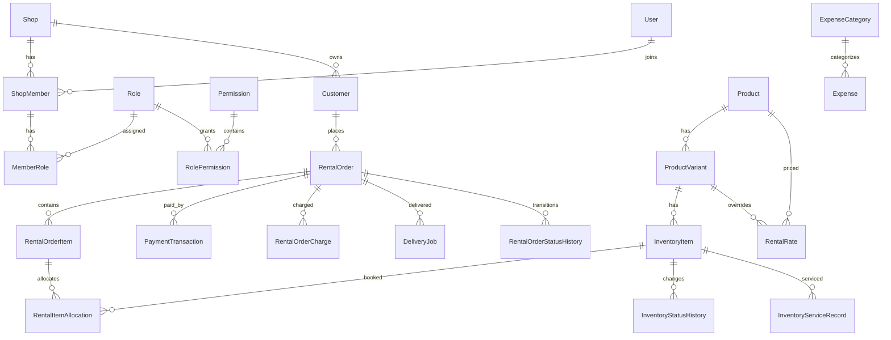

# Database design

PostgreSQL is the source of truth. Prisma is the application ORM, while committed SQL migrations may contain PostgreSQL-specific constraints Prisma cannot express (notably booking exclusion constraints).

## High-level ERD



## Product versus physical inventory

`products` describes a sell/rent-facing model such as “Váy Aurora”. `product_variants` describes size/color variants. `inventory_items` describes individual physical pieces such as `AUR-S-RED-001`.

Never replace this with a simple `products.quantity`. Individual pieces have different booking, cleaning, repair, damage and loss states.

## Rental interval semantics

Intervals are half-open: `[reserved_from, reserved_until)`.

A booking ending exactly at 12:00 and another beginning at exactly 12:00 do not overlap. If the shop needs cleaning/buffer time, extend `reserved_until` when allocating or introduce an explicit blocking allocation policy; do not weaken the database constraint.

The production protection lives in the initial migration:

```sql
EXCLUDE USING gist (
  inventory_item_id WITH =,
  tstzrange(reserved_from, reserved_until, '[)') WITH &&
)
WHERE (status IN ('HELD', 'CONFIRMED', 'ACTIVE'));
```

## Rental status dimensions

Order lifecycle and money state are separate:

- order status: `RESERVED`, `CONFIRMED`, `ACTIVE`, `COMPLETED`, `CANCELLED`.
- payment status: `UNPAID`, `PARTIALLY_PAID`, `PAID`, `REFUNDED`.
- deposit status: `NOT_REQUIRED`, `PENDING`, `PARTIALLY_HELD`, `HELD`, `PARTIALLY_REFUNDED`, `REFUNDED`, `FORFEITED`.

`OVERDUE` is derived from `rentalEndAt < now` plus an active order status. Do not persist it as an independent source of truth.

## Money

All money uses `NUMERIC(18,2)`. Do not change to floating-point.

A payment transaction records direction (`IN`/`OUT`) and purpose. Deposits (`DEPOSIT`, `DEPOSIT_REFUND`) are excluded from realized revenue reporting.

Order monetary columns are immutable-ish snapshots used for operational speed and historical correctness. Payment status is recomputed from transaction history after a money movement.

## Snapshots

`rental_order_items` stores product/variant names and agreed prices at booking time. Catalog price/name changes must not rewrite historical orders.

## Deletion policy

- catalog/customer: archive where historical records exist.
- orders: status transition, never hard-delete after business use.
- payment/expense: void, never silently delete.
- audit history: append-only.

## Multi-tenancy

Each tenant-owned aggregate stores `shop_id`; application repositories scope queries using authenticated `shopId`. Cross-shop IDs from request bodies must be validated in the same shop. Before exposing this as a public multi-tenant SaaS, add PostgreSQL RLS or composite tenant foreign keys as a second isolation layer.

Audit request IDs use VARCHAR(100), matching middleware correlation IDs, through
202609110001_audit_request_id_text. Rental idempotency reuses row UUID as an ownership
token and createdAt as acquisition time; see [RELIABILITY.md](RELIABILITY.md) before deployment.

## Migration rules

1. Edit `prisma/schema.prisma`.
2. For ordinary schema changes run `npm run db:migrate:dev -- --name <name>`.
3. Inspect generated SQL before committing.
4. Add PostgreSQL-specific indexes/constraints manually when needed.
5. Never use `prisma db push` in production.
6. Deploy with `prisma migrate deploy`.
7. Use expand/migrate/contract for destructive/high-volume changes.
