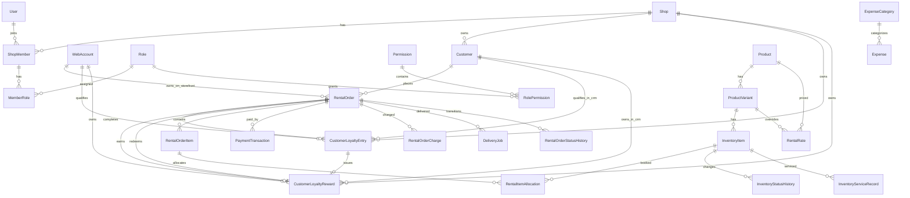

# Database design

Manual confirmation storage and transaction invariants: [Admin confirmation](ADMIN_CONFIRMATION.md).

PostgreSQL is the source of truth. Prisma is the application ORM, while committed SQL migrations may contain PostgreSQL-specific constraints Prisma cannot express (notably booking exclusion constraints).

## High-level ERD


```mermaid
erDiagram
  Shop ||--o{ ShopMember : has
  WebAccount ||--o{ RentalOrder : owns_on_storefront
  User ||--o{ ShopMember : joins
  ShopMember ||--o{ MemberRole : has
  Role ||--o{ MemberRole : assigned
  Role ||--o{ RolePermission : grants
  Permission ||--o{ RolePermission : contains

  Shop ||--o{ Customer : owns
  Shop ||--o{ CustomerLoyaltyEntry : owns
  Shop ||--o{ CustomerLoyaltyReward : owns
  Customer ||--o{ RentalOrder : places
  WebAccount ||--o{ CustomerLoyaltyEntry : qualifies
  WebAccount ||--o{ CustomerLoyaltyReward : owns
  Customer ||--o{ CustomerLoyaltyEntry : qualifies_in_crm
  Customer ||--o{ CustomerLoyaltyReward : owns_in_crm
  RentalOrder ||--o| CustomerLoyaltyEntry : completes
  CustomerLoyaltyEntry ||--o| CustomerLoyaltyReward : issues
  RentalOrder ||--o| CustomerLoyaltyReward : earns
  RentalOrder ||--o| CustomerLoyaltyReward : redeems
  Product ||--o{ ProductVariant : has
  ProductVariant ||--o{ InventoryItem : has
  Product ||--o{ RentalRate : priced
  ProductVariant ||--o{ RentalRate : overrides

  RentalOrder ||--o{ RentalOrderItem : contains
  RentalOrderItem ||--o{ RentalItemAllocation : allocates
  InventoryItem ||--o{ RentalItemAllocation : booked
  RentalOrder ||--o{ PaymentTransaction : paid_by
  RentalOrder ||--o{ RentalOrderCharge : charged
  RentalOrder ||--o{ DeliveryJob : delivered
  RentalOrder ||--o{ RentalOrderStatusHistory : transitions

  InventoryItem ||--o{ InventoryStatusHistory : changes
  InventoryItem ||--o{ InventoryServiceRecord : serviced
  ExpenseCategory ||--o{ Expense : categorizes
```

## Product versus physical inventory

`products` describes a sell/rent-facing model such as “Váy Aurora”. `product_variants` describes size/color variants. `inventory_items` describes individual physical pieces such as `AUR-S-RED-001`.

Never replace this with a simple `products.quantity`. Individual pieces have different booking, cleaning, repair, damage and loss states.

### Complimentary accessory eligibility

`products.allow_free_accessory` is a required boolean, default false. It is the
sole catalog eligibility for complimentary selection, independent of category.
Variants and inventory inherit it; normal paid rental remains available whether
it is enabled or disabled. Updating without the field preserves its current value.

Migration `202610070001_free_accessory_eligibility` backfills previous ACCESSORY
products to true, then removes `products.kind`, its CHECK and index. A shop-scoped
eligibility/visibility index replaces that index. Existing migration files remain
unchanged. Apply migrations before starting the new backend and deploy matching
Admin/Web contracts together.

## Complimentary accessories (RP08)

Migration `202610060002_rental_accessory_billing` originally added `billing_role`
and the legacy `product_kind_snapshot`. Existing values remain untouched.
The eligibility migration makes that legacy field nullable without a default;
new bookings leave it null and capture `allow_free_accessory_snapshot` from the
catalog in the Serializable transaction. Order roles and pricing never derive
from current catalog data. Database CHECKs require a free line to have captured
true eligibility (or the retained legacy accessory snapshot for old orders),
and zero rental, line total, deposit and discount. False eligibility cannot pass
through a null SQL comparison.

Entitlement is one free physical accessory per paid physical unit, pooled within
the order. Paid standalone accessories count; free lines do not count toward
either entitlement or the cycle quantity tier. Excess accessories must be sent as
paid lines. The application and transaction boundary validate entitlement, while
the existing PostgreSQL allocation exclusion constraint protects both line roles
against concurrent/overlapping bookings. Duplicate variant/role lines are merged
on Web; paid/free lines remain distinct and use disjoint physical inventory IDs.

Apply all committed migrations before starting the updated booking writers.
Prisma Client must be regenerated after the schema change. See
[Accessory rentals](RENTAL_ACCESSORIES.md) for the API and recovery contract.

## Rental interval semantics

Intervals are half-open: `[reserved_from, reserved_until)`.

A booking ending exactly at 12:00 and another beginning at exactly 12:00 do not overlap. If the shop needs cleaning/buffer time, extend `reserved_until` when allocating or introduce an explicit blocking allocation policy; do not weaken the database constraint.

The production protection lives in the initial migration:

```sql
EXCLUDE USING gist (
  inventory_item_id WITH =,
  tstzrange(reserved_from, reserved_until, '[)') WITH &&
)
WHERE (status IN ('HELD', 'CONFIRMED', 'ACTIVE'));
```

## Inventory operational condition vs Rental occupancy

Physical inventory operational condition and rental reservation occupancy are strictly decoupled:

- `inventory_items.current_status`: Only stores physical operational states (`AVAILABLE`, `CLEANING`, `REPAIRING`, `DAMAGED`, `LOST`, `RETIRED`). Enforced by PostgreSQL constraint `inventory_items_operational_status_check`.
- `rental_item_allocations`: Sole source of truth for rental reservations and occupancy (`HELD`, `CONFIRMED`, `ACTIVE`, `RETURNED`, `CANCELLED`).
- Rental lifecycle transitions do not set `inventory_items.current_status = 'RENTED'`.
- Items with active unreleased allocations (`status = 'ACTIVE'`, `released_at IS NULL`) remain occupied regardless of elapsed `reserved_until` timestamps.

## Rental status dimensions

Order lifecycle and money state are separate:

- order status: `RESERVED`, `CONFIRMED`, `ACTIVE`, `COMPLETED`, `CANCELLED`.
- payment status: `UNPAID`, `PARTIALLY_PAID`, `PAID`, `REFUNDED`.
- deposit status: `NOT_REQUIRED`, `PENDING`, `PARTIALLY_HELD`, `HELD`, `PARTIALLY_REFUNDED`, `REFUNDED`, `FORFEITED`.

`OVERDUE` is derived from `rentalEndAt < now` plus an active order status. Do not persist it as an independent source of truth.

## Customer loyalty rewards

Each settled order that reaches `COMPLETED` contributes one qualification. The
qualification owner is the recorded `webAccountId` when the order belongs to a
storefront account; otherwise it is the CRM `customerId`. These scopes are
separate and never merge through phone or email. Every fifth qualification in
either scope creates a 50,000 VND reward and the next cycle begins at zero.

`CustomerLoyaltyEntry` retains the completed-order qualification and its owner.
`CustomerLoyaltyReward` stores each issued reward and its `AVAILABLE`, `REDEEMED`
or `REVOKED` state. Settlement writes the qualification, reward and outbox event
in its Serializable transaction. `202610080001_customer_loyalty_rewards`
backfills all historical completed orders, assigning account-linked orders to
their web account and other orders to their CRM customer. All historical
milestones without recorded redemption are imported as available rewards.

The progress and reward-balance reads are exposed separately at
`GET /web/account/loyalty` and `GET /admin/customers/:id/loyalty`. Web reads are
derived from the authenticated account; they do not accept a customer or account
ID from the request.

## Money

RP13 migration `202610060003_return_item_fees` adds nullable configured/agreed time
fees, override reason and pricing version to return inspections. Old returns remain
NULL; new returns capture all SKU fees, including zero for free accessories. Before
settlement, fee adjustments preserve configured values, void old time-charge rows,
create replacements and audit their change in the same transaction. See
[Return fees](RENTAL_RETURN_FEES.md) for deployment and compatibility.

All money uses `NUMERIC(18,2)`. Do not change to floating-point.

A payment transaction records direction (`IN`/`OUT`) and purpose. Deposits (`DEPOSIT`, `DEPOSIT_REFUND`) are excluded from realized revenue reporting.

Order monetary columns are immutable-ish snapshots used for operational speed and historical correctness. Payment status is recomputed from transaction history after a money movement.

## Snapshots

`rental_order_items` stores product/variant names and agreed prices at booking time. Catalog price/name changes must not rewrite historical orders.

The existing `app_settings` JSON value at key `rental_policy` stores only the
editable base cycle price, next-day surcharge and default cash deposit. Quantity
thresholds, renewal days, online duration and other fixed business rules come
from backend code. Migration `202610070004_simplify_rental_policy_setting`
removes their legacy copies from JSON without changing historical order snapshots
or the `rental_rates` table.
RP03 writes versioned cycle pricing snapshots into the existing
`rental_order_items.pricing_snapshot` JSON column, including the captured policy,
physical quantity context, overrides and calculation breakdown. Booking validates
those amounts inside its existing serializable transaction. Existing unversioned
order snapshots retain their original rate semantics; the deprecated Admin
full-period override writes an explicit legacy version. No order backfill or
table schema change is needed. See
[Business types](BUSINESS_TYPES.md#cycle-priced-quotes-and-booking-rp03).

## Deletion policy

- catalog/customer: archive where historical records exist.
- orders: status transition, never hard-delete after business use.
- payment/expense: void, never silently delete.
- audit history: append-only.

## Single-shop application and shop-scoped data

Shop-owned aggregates store `shop_id`; application repositories scope queries using the authenticated `shopId`. Cross-shop IDs from request bodies must be validated in the same shop. The current application manages one shop; if Kitty later serves multiple shops from a shared SaaS deployment, add PostgreSQL RLS or composite shop foreign keys as a second isolation layer.

Audit request IDs use VARCHAR(100), matching middleware correlation IDs, through
202609110001_audit_request_id_text. Rental idempotency reuses row UUID as an ownership
token and createdAt as acquisition time; see [RELIABILITY.md](RELIABILITY.md) before deployment.

Customer phone identity is canonicalized to a ten-digit Vietnamese national number
(`0xxxxxxxxx`) and unique per shop. It is a CRM lookup key only: matching a phone never
authorizes linking a User account; a future account link must require verified phone ownership.
Migration `202609120001_customer_phone_uniqueness` backfills from the display phone and reports
invalid or duplicate legacy rows for manual reconciliation without merging customer history.

Storefront identities use `web_accounts` and remain separate from staff `users`/memberships
and shop CRM customers. Their phone is globally unique in canonical E.164 form, enforced
by a unique index and a format CHECK. `phone_verified_at` is the sole activation source.
`web_otp_challenges` stores HMAC hashes, expiry, attempts, consumption and resend timing;
its partial index permits one pending challenge per account. `web_refresh_tokens` stores only
SHA-256 token hashes with expiry, consumption and revocation state. Refresh-family tables retain
lineage and compromise state for both admin and storefront sessions. Registration and its first challenge are atomic. OTP
verification and resend lock the account and update their related rows transactionally.
`AUTH_CLEANUP_*` retention keeps OTP terminal records for 24 hours and complete refresh
families for 30 days by default; see [Auth ephemeral-data cleanup](AUTH_CLEANUP.md).

Rental order creation provenance is separate from both storefront authentication and CRM
identity. `rental_orders.source` is `ONLINE` for storefront checkout or
`OFFLINE` for Admin/manual entry. `web_account_id` is nullable storefront ownership and does
not replace `customer_id`. A checkout with a verified WebAccount stores that account ID;
New checkout requires a verified email account; retained guest orders and Admin/manual orders store NULL. Existing orders are never inferred or
claimed from customer contact fields; see [Rental order origin](RENTAL_ORDER_ORIGIN.md).

Storefront actions retain their actor separately from staff identities. Migration
`202609280004_audit_web_account_actor` adds nullable
`audit_logs.actor_web_account_id` with `ON DELETE SET NULL` and an actor/timeline index;
it does not rewrite historical audit rows. Storefront order self-cancellation is allowed
only for the verified account's unpaid `ONLINE` `RESERVED` order and uses the same
transactional cancellation lifecycle as Admin commands; see
[Rental order origin](RENTAL_ORDER_ORIGIN.md).

## Storefront email contact and consumer queue

`202610070003_web_account_contact_profile` adds nullable `web_accounts.full_name`
and `contact_phone` for checkout defaults. Name is trimmed, 2–100 characters; phone
is canonical `0` plus nine digits. Contact phone is not unique and is not an identity,
OTP verification or CRM ownership key. Legacy `phone`/`phone_verified_at` remain untouched;
existing rows are not inferred or backfilled. Apply this migration and regenerate
Prisma Client before running the updated Web Auth reads. Profile updates do not rewrite
historical orders, CRM or notification recipients. New ONLINE writes require a live,
enabled account with verified email, rechecked in the booking transaction.

Migration `202610070002_rental_order_emails` adds nullable immutable
`rental_orders.notification_email` without historical backfill, and extends
`notification_logs` with an event FK, presentation snapshot, frozen provider payload,
claim token/lease and retry timing. Event uniqueness and a partial order/template index
prevent repeated logical email tasks. A queue CHECK validates only new event-linked
EMAIL records, preserving existing logs. Apply before starting new writers and regenerate
Prisma Client. See [Rental order emails](RENTAL_ORDER_EMAILS.md).

## Migration rules

1. Edit `prisma/schema.prisma`.
2. For ordinary schema changes run `npm run db:migrate:dev -- --name <name>`.
3. Inspect generated SQL before committing.
4. Add PostgreSQL-specific indexes/constraints manually when needed.
5. Never use `prisma db push` in production.
6. Deploy with `prisma migrate deploy`.
7. Use expand/migrate/contract for destructive/high-volume changes.

### Operational-status repair migration

`202609110003_repair_inventory_operational_status` normalizes legacy RESERVED/RENTED
values to AVAILABLE only when an unreleased blocking allocation exists in the same
shop. Orphaned values become CLEANING for inspection before reuse. Allocation rows,
status history and financial history are preserved; the migration is transactional
and adds `inventory_items_operational_status_check`. The original
`rental_item_no_overlap` exclusion constraint is unchanged. Unexpected operational
values fail the CHECK rather than silently being rewritten.

Deploy with rental/warehouse writers stopped, apply the migration, then start the
new application version. Old instances that persist RENTED are incompatible with
the new CHECK. Do not run old and new writers concurrently during deployment.

### Catalog archive and pricing integrity

Product and inventory archive use the shared unreleased HELD/CONFIRMED/ACTIVE
allocation predicate, without a date cutoff. Product archive and booking both use
Serializable transactions: booking reads the product/variant rentability through
the selected inventory inside its transaction, and archive reads allocations
before changing the product. PostgreSQL aborts concurrent stale decisions for retry.
Raw external SQL writers must follow this protocol; archive is not a SQL trigger.

`202609110004_harden_rental_rate_and_media_uniqueness` adds:

- `rental_rates_variant_active_unique`: active (shop, product, variant, duration).
- `rental_rates_product_active_unique`: active (shop, product, duration), NULL variant only.
- `product_variants_unarchived_combination_unique`: unarchived (product, size, color),
  with PostgreSQL NULLS NOT DISTINCT so absent size/color cannot bypass uniqueness.
- `product_media_product_id_primary_unique`: one primary media row per product.

Pricing lookup prefers the variant rate, then the product-level fallback, for the
requested duration. Existing validFrom/validUntil fields are not part of pricing
selection, so they do not create separate active scopes. Inactive rates remain
unrestricted; the existing price command updates the active row in place.

The migration locks the affected tables and checks duplicates before creating
indexes, all in one transaction. It deliberately fails for duplicate active rates,
unarchived variant combinations or primary media, without choosing a price,
merging physical identities, or deleting history. Reconcile reported duplicate
scopes before retrying deployment. This requires PostgreSQL 15+ (the repo uses 17).
Plan a write maintenance window for index creation. If Prisma records a failed
migration, resolve it as rolled back only after checking PostgreSQL rollback and
reconciling duplicates, then redeploy. Dropping the new indexes is the schema
rollback; it removes protection and must be coordinated with the application.
There is no data rewrite to undo.

## Manual receipt ledger

Migration `202609140002_manual_payment_ledger` adds receipt source, a unique receipt
key, and unique provider transaction references. It restores legacy manual receipts
from confirmation/settlement records without assigning an unknown historical payment
method. New receipts and lifecycle changes commit atomically. Deposits remain separate
from revenue; internal deposit offsets use paired entries. See
[Admin confirmation](ADMIN_CONFIRMATION.md) for reconciliation and deployment details.

## Dashboard allocation count index

`202609150001_dashboard_allocation_count` adds
`rental_item_allocations(shop_id, status, released_at)` for the Dashboard active
occupancy count. Existing booking/overlap constraints are unchanged. See
[Dashboard query audit](DASHBOARD.md).
